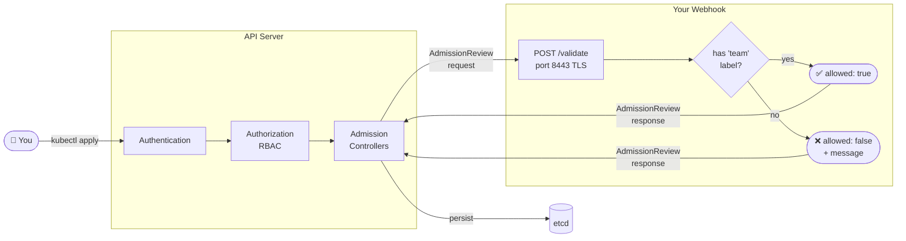
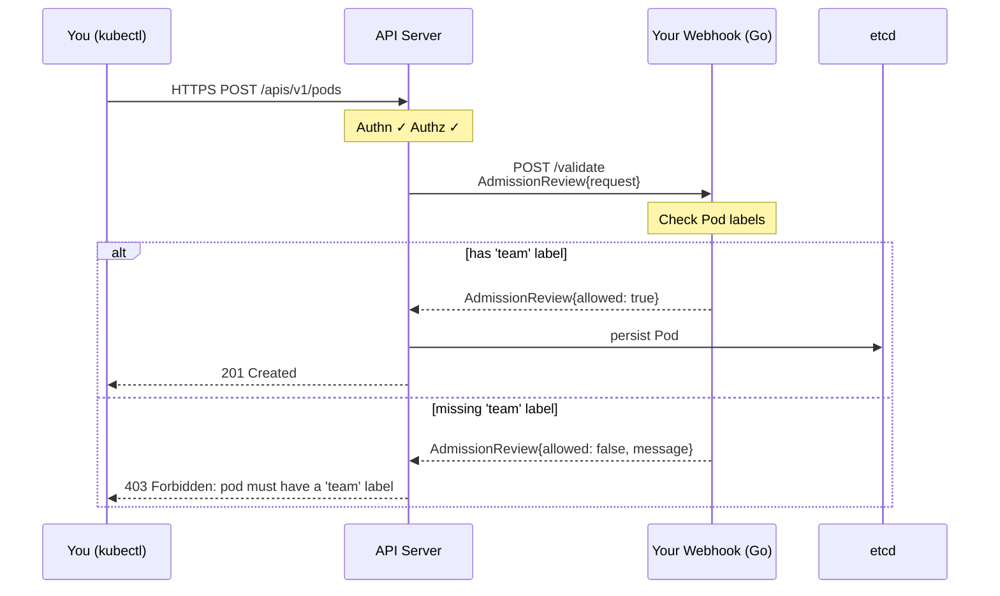
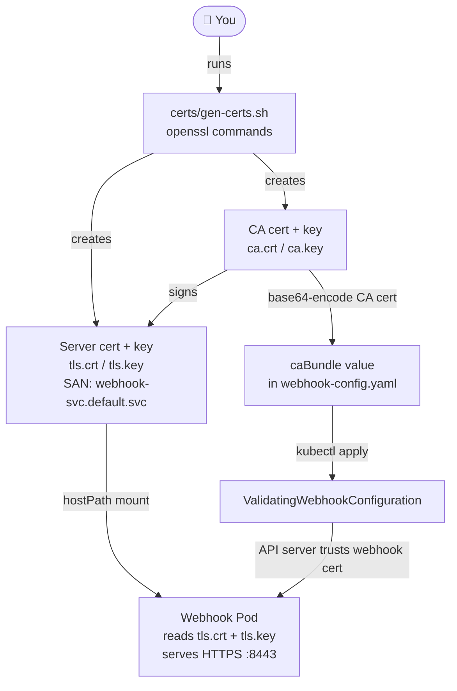

# Kubernetes Admission Webhooks in Go

A minimal learning project that builds a real **Validating Admission Webhook** from scratch in Go.

> **Goal:** Understand how the Kubernetes API server admission chain works by building something real — not just reading about it.

---

## What is an Admission Webhook?

When you run `kubectl apply -f pod.yaml`, your request doesn't go straight to storage.
It passes through a chain of **admission controllers** inside the API server first.

There are two kinds of webhooks you can plug into this chain:

| Type | What it does |
|------|-------------|
| **Validating** | Inspect the request and **allow or deny** it. Cannot modify. |
| **Mutating** | Can **modify** the object (e.g. inject a sidecar, add labels) before it's saved. |

We're building a **Validating** webhook — the simpler of the two — that enforces:

> **Every Pod must have a `team` label. No label? Request denied.**

---

## The Admission Chain



---

## The HTTP Round-Trip



---

## The AdmissionReview Contract

This is the **entire interface** between the API server and your webhook — just two JSON structs:

**Request** (API server → your webhook):
```json
{
  "apiVersion": "admission.k8s.io/v1",
  "kind": "AdmissionReview",
  "request": {
    "uid": "abc-123",
    "operation": "CREATE",
    "resource": { "group": "", "version": "v1", "resource": "pods" },
    "object": { }
  }
}
```

**Response** (your webhook → API server):
```json
{
  "apiVersion": "admission.k8s.io/v1",
  "kind": "AdmissionReview",
  "response": {
    "uid": "abc-123",
    "allowed": false,
    "status": { "message": "pod must have a 'team' label" }
  }
}
```

> **Key rule:** `response.uid` must always echo back `request.uid`.

---

## Why TLS?

The API server **only calls HTTPS** webhook endpoints. It verifies the server cert using
the `caBundle` field in your `ValidatingWebhookConfiguration`.

### How the cert chain is set up



> **Why the SAN matters:** The server cert must include a Subject Alternative Name
> matching the in-cluster DNS name (`webhook-svc.default.svc`) — otherwise the API
> server rejects the TLS handshake even with a valid caBundle.

### The ValidatingWebhookConfiguration

This is the manifest that tells the API server *"call my webhook for these resources"*:

```yaml
# manifests/webhook-config.yaml
apiVersion: admissionregistration.k8s.io/v1
kind: ValidatingWebhookConfiguration
metadata:
  name: team-label-validator
webhooks:
  - name: validate-team-label.k8s-webhooks.local
    # Which requests to intercept
    rules:
      - apiGroups:   [""]
        apiVersions: ["v1"]
        resources:   ["pods"]
        operations:  ["CREATE"]
    # Where to send them
    clientConfig:
      service:
        name:      webhook-svc       # must match service.yaml
        namespace: default
        path:      /validate
      caBundle: <base64-encoded-ca.crt>  # paste output of: base64 -w0 ca.crt
    # If the webhook is unreachable, pass or fail?
    failurePolicy: Ignore            # use Fail in production; Ignore = webhook down → request passes
    # Exclude system namespaces — intercepting kube-system can break the cluster
    namespaceSelector:
      matchExpressions:
        - key: kubernetes.io/metadata.name
          operator: NotIn
          values: [kube-system, kube-public]
    admissionReviewVersions: ["v1"]
    sideEffects: None
```

**Key fields explained:**

| Field | What it does |
|-------|-------------|
| `rules` | Which resource + operation triggers the webhook (we watch Pod CREATE) |
| `clientConfig.service` | In-cluster DNS pointing to your Go server |
| `caBundle` | Base64 CA cert — API server uses this to verify your webhook's TLS |
| `failurePolicy: Ignore` | If webhook is down, let the request through (safe for dev) |
| `namespaceSelector` | Excludes `kube-system` / `kube-public` — never intercept system namespaces |
| `sideEffects: None` | Tells k8s this webhook has no side effects (required field) |

---

## Project Structure

```
k8s-webhooks/
├── webhook/
│   ├── main.go         # HTTPS server on :8443
│   ├── handler.go      # Parse AdmissionReview, build response
│   ├── validator.go    # Business rule: must have 'team' label
│   └── validator_test.go  # Table-driven tests (5 cases)
├── certs/
│   └── gen-certs.sh    # Generate self-signed TLS cert via openssl
├── manifests/
│   ├── deployment.yaml        # Deploy webhook pod into k3s
│   ├── service.yaml           # ClusterIP service
│   ├── webhook-config.yaml    # ValidatingWebhookConfiguration
│   ├── test-pod-allowed.yaml  # Test: pod WITH 'team' label → admitted
│   └── test-pod-denied.yaml   # Test: pod WITHOUT 'team' label → rejected
└── Makefile                   # build / certs / run / test
```

---

## Stages

- [x] **Stage 1** — Flow diagrams + README
- [x] **Stage 2** — Build the Go webhook server
- [x] **Stage 3** — Deploy to k3s + live test

---

## Prerequisites

- Go 1.26 (`snap install go --classic`)
- k3s (`curl -sfL https://get.k3s.io | sh -`) — already running if you followed Stage 3
- openssl (already installed)
